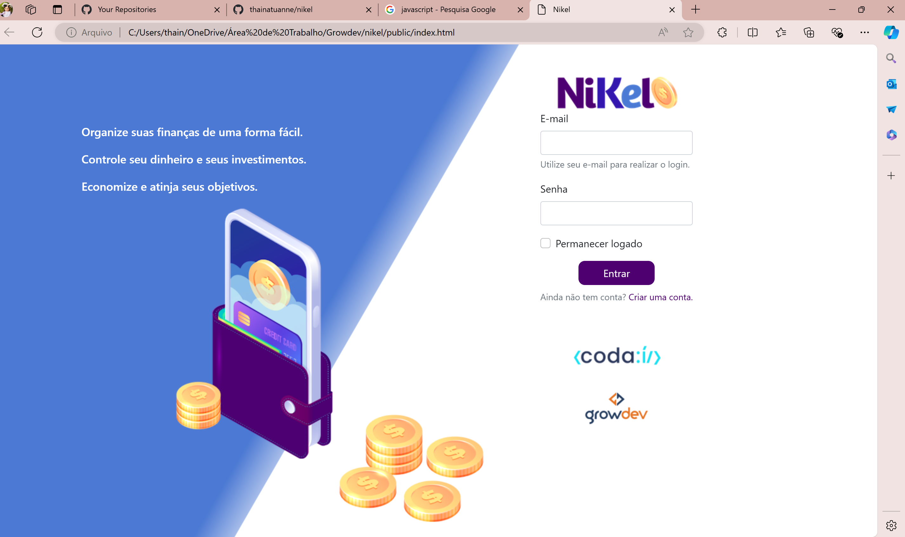
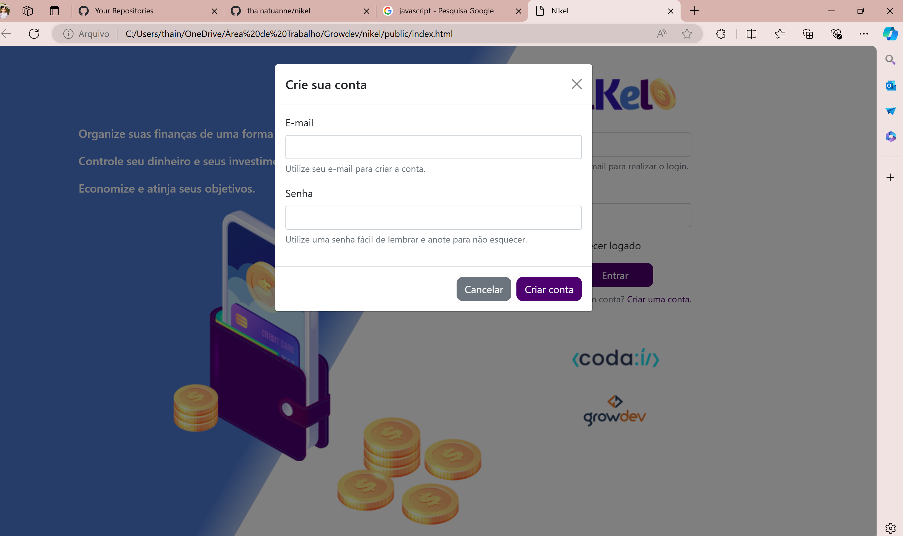
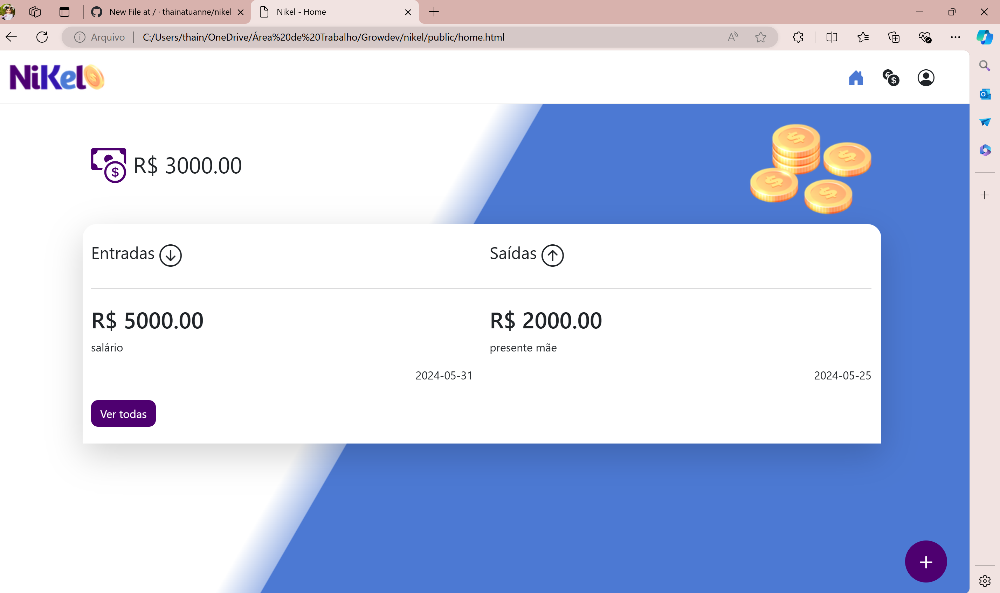
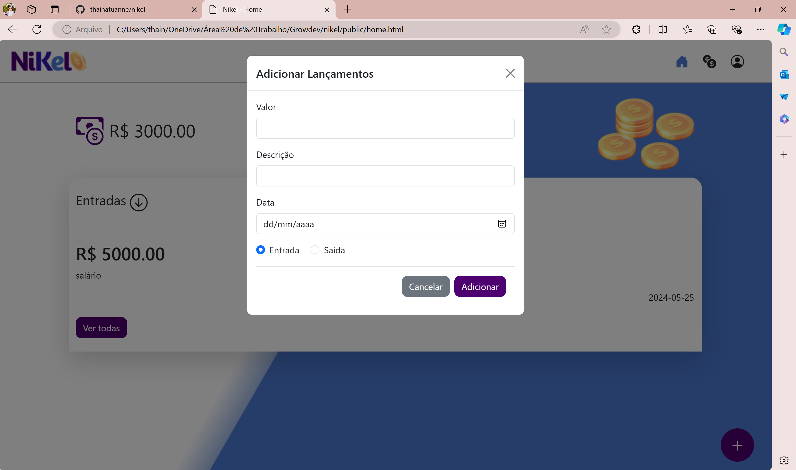
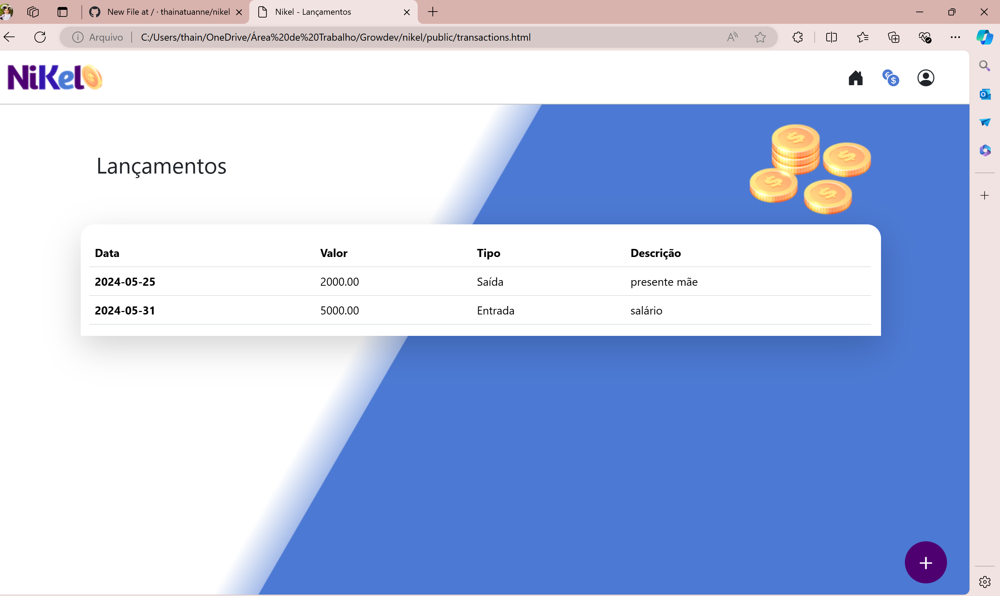

<h1>Projeto Níkel para Bolsa Growdev.</h1>

## 3 páginas html:
- index.html
- home.html
- transactions.html

## 1 pasta css:
- styles.css

## 1 pasta JS:
- home.js
- index.js
- transactions.js

 

 <h2>Index</h2>
 
  

<h2>Criar Conta</h2>

 

<h2>Home</h2>

 

<h2>Lançamentos</h2>

 
